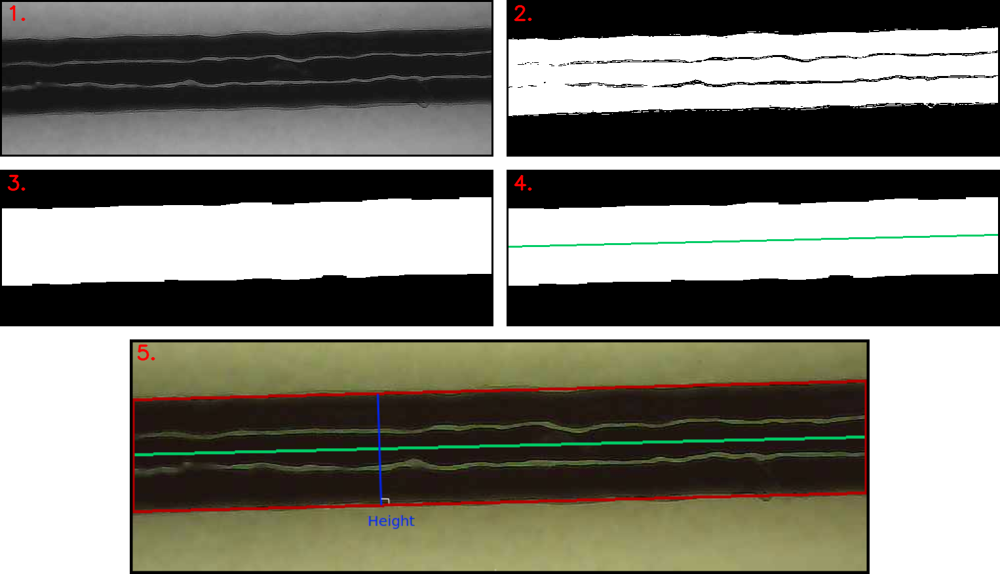

# Thesis

Repo contains code supporting 4th-year bachelor thesis "Developing Machine Learning Models to Predict Line Properties From Direct Ink Writing"

### line_measurer.py 

Measures line width by approximating the line as a parallelogram. Processing steps:

1. Convert the image to grayscale
2. Perform thresholding using the line edge pixel intensity
3. Perform morphological operations closing and opening to close small holes inside the foreground object and remove noise
4. Iterate through every pixel column of image 3. At each column, record the midpoint between the top and bottom-most white pixel. Generate a line of best fit through the midpoints and record the length of the line.
5. Count the total number of white pixels in image 3. Divide the sum by the length from part 4 to get the line width. This is just Height=Area/Length
6. Multiply the line width in pixels by the image scale

### linear_regression_plots.ipynb

Jupyter notebook that documents the thought process followed to arrive at a segmented linear regression model.

Utilizes Charlie Pilgrim's iterative piecewise regression package ([link](https://github.com/chasmani/piecewise-regression)) to estimate breakpoints and generate plots 

### NN_model.ipynb

Jupyter notebook documents the thought process followed in the construction of the neural network, hyperparameter selection, and findings. Utilizes a feedforward multilayer perception model.

### ldr_sampling.ipynb

Jupyter notebook visually explains why high-value LDR values are sampled less even though the sample space uses an uniform sampling method (Latin hypercube).

